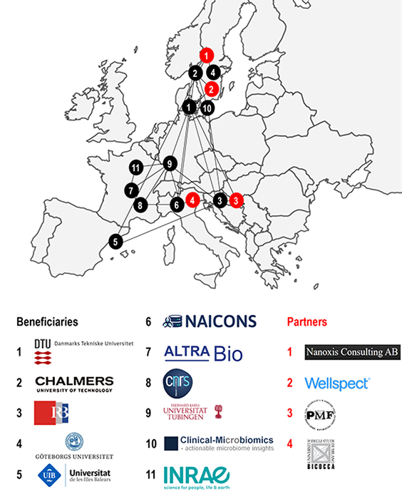

PEST-BIN is a Marie Skłodowska-Curie Innovation Training Network (ITN), funded by the European Commission, Horizon 2020 Program. The Network provides PhD training to 15 Early Stage Researchers (ESRs). \
 

**Network objectives**\
Antibiotic resistance has been named as one of the greatest threats to global health by the World Health Organization. There are increasing numbers of bacterial infections not responding to known antibiotics. The humanity needs to pioneer disruptive technologies to re-gain the upper hand. To address this challenge, the PEST-BIN consortium mobilizes six universities, three research institutes, a hospital and five private companies with one common mission: to pioneer novel technologies to fight bacterial infections. Our network will combine very diverse tools: from nano-engineering, antibiotic discovery and production, via proteomics-based diagnostics to big data analysis using artificial intelligence (AI) – all of which will be contribute to new, interdisciplinary technologies. All PEST-BIN ESRs will be trained in an intersectoral environment – experiencing a tight collaboration among academia, healthcare and the private sector.

**Network composition**

