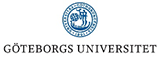

test

<table width="584" border="0">
                  <tbody>
                    <tr>
                      <td width="190">Beneficiaries</td>
                      <td width="190">6. </td>
                      <td width="190">Partners</td>
                    </tr>
                    <tr>
                      <td>1. </td>
                      <td>7. </td>
                      <td>1. </td>
                    </tr>
                    <tr>
                      <td>2. </td>
                      <td>8. </td>
                      <td>2. </td>
                    </tr>
                    <tr>
                      <td>3. </td>
                      <td>9. </td>
                      <td>3. </td>
                    </tr>
                    <tr>
                      <td>4. </td>
                      <td>10. </td>
                      <td>4. </td>
                    </tr>
                    <tr>
                      <td>5 .</td>
                      <td>11. </td>
                      <td>&nbsp;</td>
                    </tr>
                  </tbody>
                </table>